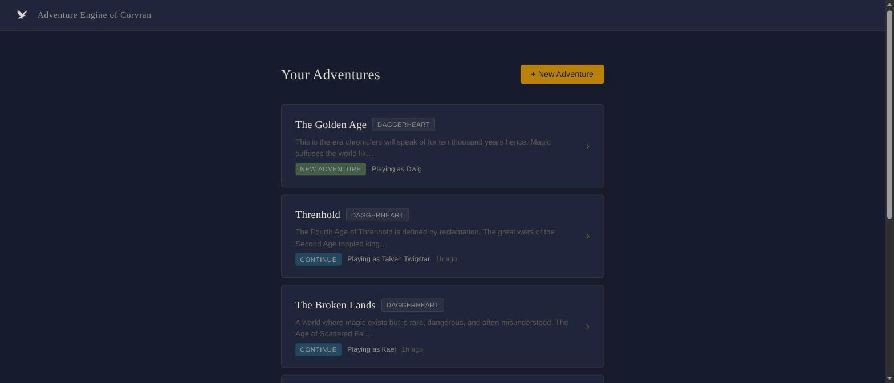
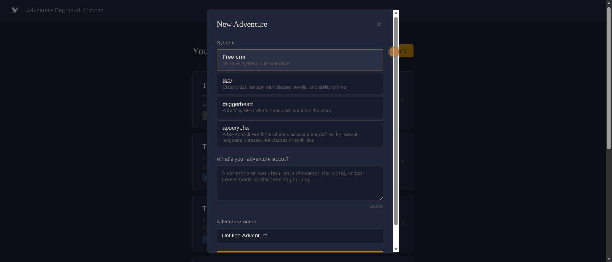
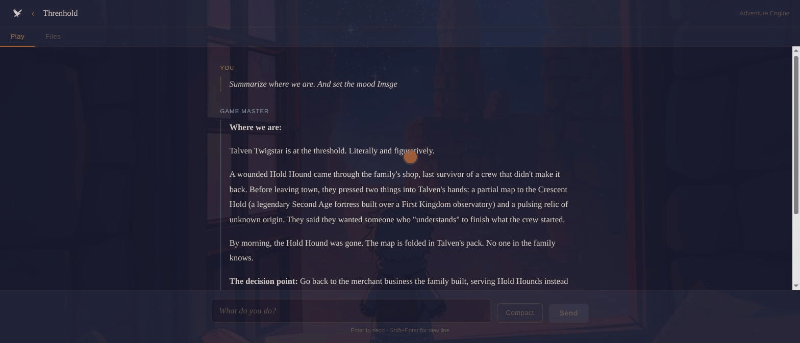

# Adventure Engine of Corvran — Usage Guide

A collaborative storytelling tool where you and an AI Game Master make up a story together. The AI plays with you, maintains the rules, and creates stakes — but never decides what your character does.

---

## Your Adventures

When you open the app, you land on the adventure list.



Each card shows:

- **Adventure name** and **system tag** (DAGGERHEART, D20, APOCRYPHA, or none for freeform)
- A snippet of the adventure concept
- **NEW ADVENTURE** or **CONTINUE** status badge
- Who you're playing as, and when you last played

Click any adventure card to jump back in.

---

## Creating a New Adventure

Click **+ New Adventure** in the top right.



The wizard has three fields:

**System** — choose the ruleset the GM will use:

| Option | Description |
|--------|-------------|
| Freeform | Pure narrative, no mechanics |
| d20 | Classic fantasy with classes, levels, and ability scores |
| daggerheart | Hope and fear drive the story |
| apocrypha | Characters defined by natural-language phrases, not stat blocks |

**What's your adventure about?** — One or two sentences about your character, the world, or both. Leave it blank and discover everything through play. Up to 1,000 characters.

**Adventure name** — defaults to "Untitled Adventure"; change it to something meaningful.

Click **Begin Adventure** to start. The GM will set the scene.

---

## Playing an Adventure



The play interface has two tabs: **Play** and **Files**.

### The Conversation

The **Play** tab is a two-panel conversation. Messages are labeled **YOU** and **GAME MASTER**.

The GM's responses stream in live — you'll see text appear word by word as the AI writes. Dice rolls and other tool events appear inline as part of the narrative.

The background image shifts with the mood of the story. As scenes change tone, the GM updates the atmosphere behind your conversation.

### Sending a Message

Type your action or dialogue in the input bar at the bottom:

> *What do you do?*

- **Enter** — sends the message
- **Shift+Enter** — adds a new line without sending

While the GM is responding, a **Stop** button appears. Click it to interrupt mid-stream.

### Compact

Long campaigns accumulate a lot of history. When the conversation gets long, the **Compact** button archives older exchanges and replaces them with an AI-generated recap. This happens automatically when needed, but you can also trigger it manually.

Compaction preserves the story — it just summarizes older events so the AI can keep the full context of what matters now.

---

## Adventure Files

The **Files** tab gives you a read-only view of everything the AI knows about your adventure.

The file tree on the left shows all the markdown files in your adventure directory. Click any file to read its contents on the right.

Key files in every adventure:

| File | Contents |
|------|----------|
| `adventure.md` | Name, system, concept, and current mood state |
| `character.md` | Your character — who they are, what they want |
| `world.md` | The setting, factions, and world details |
| `history.md` | The full conversation transcript |
| `artstyle.md` | Art direction for mood image generation (optional) |
| `mood.png` | The current background image |

The `characters/` subfolder holds detailed character sheets when the GM has written them out. The `past/` subfolder holds archived history chunks and their recaps.

All files are plain Markdown. You can edit them directly in `~/.corvran/adventures/<adventure-id>/` — changes take effect the next time you send a message.

---

## Adventure Data Location

Adventures are stored in `~/.corvran/adventures/` by default. Override with the `CORVRAN_HOME` environment variable.

Each adventure is a directory named after its ID. The directory structure:

```
~/.corvran/adventures/
  threnhold/
    adventure.md
    character.md
    world.md
    history.md
    artstyle.md        (optional)
    mood.png           (optional)
    characters/
      talven-twigstar.md
    past/
      1713456000-history.md
      1713456000-recap.md
```

Because everything is Markdown, you can read your adventure history, edit character sheets in your own editor, or back it all up with a simple `cp -r`.

---

## RPG Systems

Systems are plugins — reference documents the AI reads before each session. They teach the GM how a system works without baking mechanics into the application.

The engine ships with:

| System | What it is |
|--------|-----------|
| **Freeform** | No system. Pure collaborative fiction. |
| **d20** | d20/5e-style fantasy: classes, levels, ability checks, spell slots. |
| **Daggerheart** | Hope and Fear dice. Narrative-first with mechanical stakes. |
| **Apocrypha** | Characters defined by keyword phrases rather than stat blocks. Built for expressive, rules-light play. |

You pick the system when creating an adventure. It can't be changed afterward (the GM's entire session is shaped by which plugin loads).
